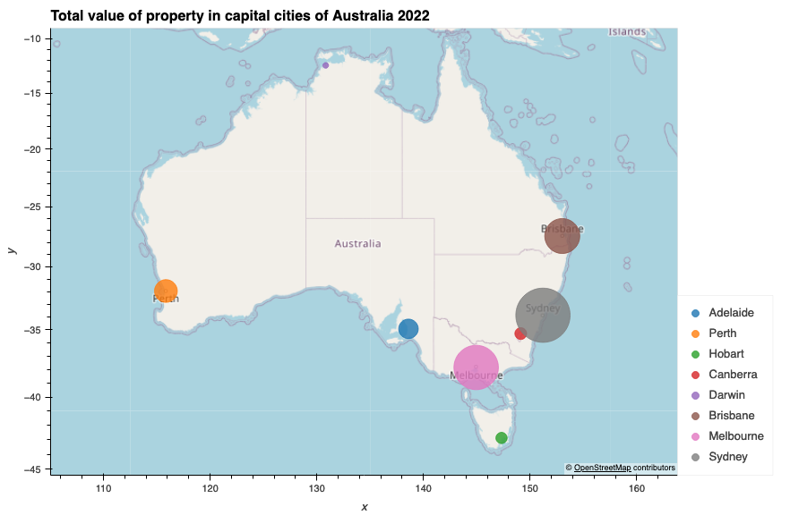
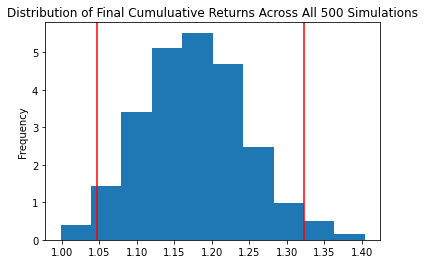

# Property Prices and Interest Rates Analysis in Australia

#### Created by: Pragya, Duc and Itzchak
## Summary
**Aim** -  Evaluate the performance of Australian residential properties and investigate its relationship with interest rate.

**Core finding** - We found a long term increase in prices and strong negative correlation between property prices and interest rate. This applies to all capital cities as well as regional areas across all states.

## Questions

### 1. How did Australian residential property perform?

The 2 plots shows the total value of all residential dwelling for 8 states and territories.
The state with highest value is NSW
The state with lowest value is the Northen Teritory

The charts above represent the median housing (established, attached) prices in Australian capital cities and regional areas.
The median house price is the sale price of the middle home in a list of properties ranked from highest sale price to lowest over a quarter.
We chose median house prices instead of the average (or mean) is because a few unusually high or lower prices can skew the average price and therefore won’t be an accurate indication of the current state of the property market.
There is a obvious upward trend of the median house prices across all states and territories. 
We note that there is a sharp increase in 2020-2021 across Australia cities, at the height of COVID. 

### 2. Is there a relationship between interest rate and Australian residential property price?
We chose RBA’s interest rate because it is a popular macro-economic indicator and is widely published.
Theoretically, we would expect an inverse relationship between Australian property prices and interest rate.

As you can see on the line chart, as the IR went down, the house price went up.

Using correction function, we find that there is a generally a negative correlation between interest rate and house prices in most states.

### 3. How will Australian residential property price behave in the future?
We then used Monte Carlo simulation to predict the Australian house price in the next 8 Quarters (or 2 years)

The conclusion is that there is a 95% chance that an initial investment of $1,000,000 in the australian realestate over the next 2 years will end within in the range of $1,046,573.77 and $1,322,564.81
 

